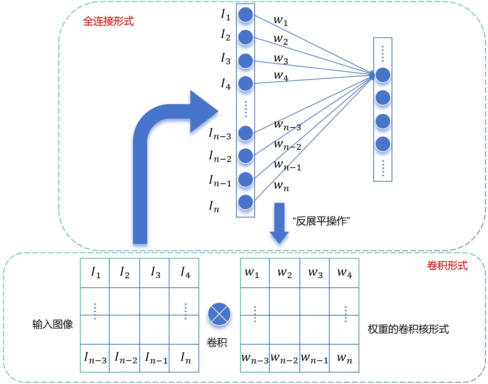

在深度学习的入门阶段，我们通常从全连接神经网络（Fully Connected Neural Network，简称 FCNN 或 MLP）开始。然而，当我们试图用 MLP 来处理图像时，很快就会遇到瓶颈。

为什么在计算机视觉领域，CNN（卷积神经网络）会取代 MLP 成为绝对的主流？这就需要我们从神经网络的设计原理说起。

这篇文章将带你回顾从 MLP 到 CNN 的思维演变过程。

## 1. 全连接神经网络 (MLP) 的困境

让我们回顾一下使用 MLP 处理图像的过程。假设我们要处理一张 **$100 \times 100$ 像素** 的灰度单通道图片，处理过程如下图所示

按照上图所示的对图像的处理，会有如下几个问题

- ##### **破坏空间结构**

​		MLP 接受的输入必须是一维向量。因此，我们必须先将 $100 \times 100$ 的二维矩阵进行 `Flatten`（展平）操作，变成一个长度为 $10,000$ 的向量。

​		$$x \in \mathbb{R}^{10000}$$

​		**问题在于：** 这个操作直接破坏了图像的**空间结构**。在图像中，像素点与其上下左右的邻居是有紧密联系的（比如构成一条线或一个形状），但展平后，像素 $(0,0)$ 和 $(0,1)$ 在向量中相邻，但 $(0,0)$ 和 $(1,0)$ 却被隔得很远。

- ##### **参数爆炸**

​		假设我们的第一个隐藏层有 $1,000$ 个神经元。由于是“全连接”，输入层的每一个像素都要和隐藏层的每一个神经元相连。

​		权值参数 $W$ 的数量为：
​		$$10,000 \times 1,000 = 10,000,000$$

​		仅仅一层网络就需要 **1000 万个参数**！这会导致两个严重后果：

​			1. **计算量巨大**：训练极其缓慢。

​			2. **过拟合**：参数过多，而数据量通常不足，模型很容易死记硬背训练集。

---

## 2. 演进第一步：局部连接 (Local Connectivity)

如何解决参数过多的问题？我们可以从人类看图的方式中获取灵感。

当我们判断图中有没有一只“狗”时，不需要一眼看完所有像素。我们可以先看局部：这里是不是像耳朵？那里是不是像眼睛？所以我们观察的是局部特征，且只需要图像主体所在的像素，而不需要图像背景。

一个很直觉的想法是，我们将图像主体（例如上图中的狗）从整张图像中裁剪出来出入到神经网络中，这样就能极大程度上减少输入的维度，进而减少网络的参数量。

但是，如何“裁剪”是一个大难题，因为存在以下问题：

1. 我们无法确定每张图像的主体在图像的什么位置，
	1. 我们无法提前知道图像主体的大小

##### 解决方案

​	对于以上的问题，我们先假设图像主体的大小不会大于某个尺度，即可以使用一个$$w*h$$大小的矩形框框出来。在此基础上，想要解决问题1，没有其他特殊的办法，只能遍历整张图像。

遍历方式为：使用一个$$w*h$$大小的矩形框从图像左上角向右和向下移动，每次移动$$stride$$长度的像素，每次移动后截取出该范围的图像。上图中不同颜色的矩形框就代表截取出来的多张图片。

> 尽管每次截取出来的图像存在重复的部分，但是为了将图像主体完整的截取出来，必须这么做，且$$stride$$还应在网络参数可接受的情况下尽可能小（$$stride$$越小，输入维度越大，网络参数越多）

我们将裁剪出来的多张图片作为网络的输入就能识别出狗。

---

## 3. 演进第二步：权值共享 (Weight Sharing)

**思考：**多张裁剪出来的图像应该是输入到一个网络中还是不同的网络中呢？

**解答：**对于多张裁剪出来的图片，神经网络都有一个共同的目的，就是从中识别出狗，那么他的网络应该是一样的，都是能够对图像中的狗产生“高响应”。

到了这一步，我们才算是真正降低了网络的参数量，极大提高了网络收敛的可能性。

如上图所示模型参数已经极大的降低了。

虽然每个神经元只看局部，但如果隐藏层有 $1,000$ 个神经元，每个神经元看不同的位置，且拥有自己独立的权重，参数量虽然减少了，但依然不少。

这里引入第二个关键思想：**平移不变性 (Translation Invariance)**。

* 如果图片左上角有一个圆形，我们需要一个“圆形检测器”。
* 如果图片右下角有一个圆形，我们依然需要这个“圆形检测器”。

既然如此，为什么不让这两个位置共享同一个检测器（权重）呢？

**操作方法：**
我们设计一个 $3 \times 3$ 或 $5 \times 5$ 的小窗口（Filter），让它在整张大图上滑动。无论滑到哪里，都使用同一组权重进行计算。

这就是 **卷积 (Convolution)** 的本质。

*(建议此处插入你生成的“滑动窗口/卷积示意图”)*

_图 2：从网格划分到滑动窗口卷积，利用权值共享大大减少了参数_

---

## 4.演进第三步：卷积核（convolutional kernel）

其实到了演进的第二步，就已经是CNN的雏形了，具体来说，看下面这张图。

使用MLP网络的方法中是将图像展平成一维向量输入到网络，各个像素和权重相乘后累加就得到了结果。

这个二维矩阵，就是我们常说的**卷积核（Convolutional Kernel）**或**滤波器（Filter）**。

* **MLP 操作**：$$y = \sum (x_{flatten} \cdot w_{flatten}) + b$$
* **CNN 操作**：$$y = \text{Conv}(I, K) = \sum_{i,j} (I_{patch}[i,j] \times K[i,j]) + b$$

从数学本质上讲，**卷积操作等价于一个受限（局部连接）且受控（权值共享）的全连接层操作。**

## 5. 演进第四步：多通道 (Multi-channel)

到了这一步，为了能够让模型的拟合能力更强，且能够识别不同的物体特征，通常会通过增加卷积核的形式来实现。

这样的CNN网络就能通过不同的卷积核就能够识别不同的物体。

---

## 6.演进第五步：感受野（Receptive Field）

通过上述的演进步骤我们就已经解决了图像主体在不同图像位置的问题，接下来就是要解决图像主体在图像中不同尺度的问题。同样的，先考虑一个最直觉的方法，使用不同大小的卷积核在图像上做卷积操作，只要卷积核的尺度种类够多，总是能够覆盖到图像主体的。但这也会导致网络的输入维度爆炸，所以我们还是得想一个等效的方法，在实现相同效果的同时减少输入维度。

我们首先使用$$3\times3$$大小的卷积核在原始图像上做卷积操作，这样我们就会得到一个矩阵，我们称这个矩阵为特征图（feature map）。这个特征图的尺寸会比原始图像小。

接着我们想使用$$5\times5$$大小的卷积核做卷积操作，但是这会导致网络的输入维度增大。那么如果在特征图上接着做卷积操作呢？

如上图所示，对于中间层特征图来说，其中的一个元素包含原始图像的$$3\times3$$大小范围内的信息，那么对于中间层特征图$$3\times3$$范围内的信息就相当于原始图像$$5\times5$$大小范围内的信息。所以我们只需要以$$3\times3$$大小的卷积核在中间层特征图上做卷积操作就能够实现在原始图像上做$$5\times5$$大小的卷积操作的同等效果。

从数学角度来看，由于卷积是线性变换，所以我们使用权重$$w$$ 乘以输入表示卷积操作，从下面的公式中可以看出，$$5\times5$$完全可以使用两次$$3\times3$$的卷积操作代替。
$$
y_{3*3} = w_2\times(w_1 \times m),y_{5*5} = w_3\times(m)
$$

**优势：**

1.  **参数更少**：$2 \times (3 \times 3) = 18$ vs $1 \times (5 \times 5) = 25$。
2.  **非线性更强**：层数越多，可以插入的激活函数（ReLU）越多，模型的拟合能力越强。

这就是为什么现代 CNN（如 VGG, ResNet）倾向于使用小卷积核深层堆叠的原因。

> 事实证明将一个任务分解成多个小任务比直接给模型一个大任务会更有效。
>
> 两次$$3\times3$$的卷积操作的卷积核权重不一样，所以表示为不同的$$w$$

## 7. 演进第六步：现代经典CNN架构

* 为了进一步压缩数据并提取鲁棒特征，现代 CNN 还在卷积层之间加入了**池化层（Pooling Layer）**。

  * **Pooling（下采样）**：保留特征的最强响应（Max Pooling），忽略微小的位置偏移，进一步减少计算量。

  至此，我们构建了一个标准的现代 CNN 架构：

  1.  **Input**：保留图像的三维结构 $(H, W, C)$。
  2.  **Backbone (Feature Extractor)**：
      * **Convolution**：利用局部连接和权值共享提取特征。
      * **Activation**：引入非线性。
      * **Pooling**：扩大感受野，降低维度。
  3.  **Head (Classifier)**：最后将提取到的高级语义特征展平，接入一个**MLP（全连接层）**进行最终的分类。

---

## 总结：从 MLP 到 CNN

现在的 CNN 架构，其实就是对 MLP 的一种**结构化约束**：

1.  **输入层**：不再展平，保留 $(H, W, C)$ 的三维结构。
2.  **隐藏层**：
    * **全连接** $\rightarrow$ **局部连接**（只关注局部特征）。
    * **独立权重** $\rightarrow$ **权值共享**（一个卷积核扫全图）。
3.  **输出层**：最后依然接入一个全连接层（或全局平均池化）来输出分类结果。

这种设计使得 CNN 在处理图像时，既保留了空间信息，又极大地降低了参数量，从而使得训练深层网络成为可能。
