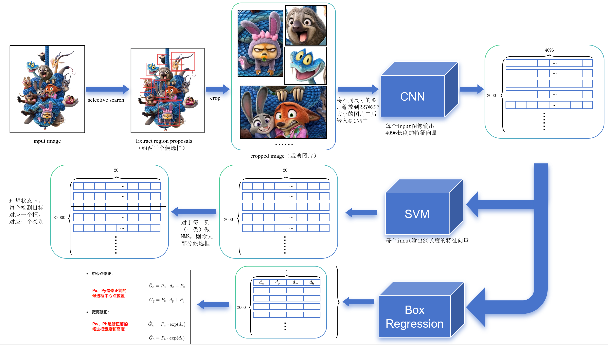
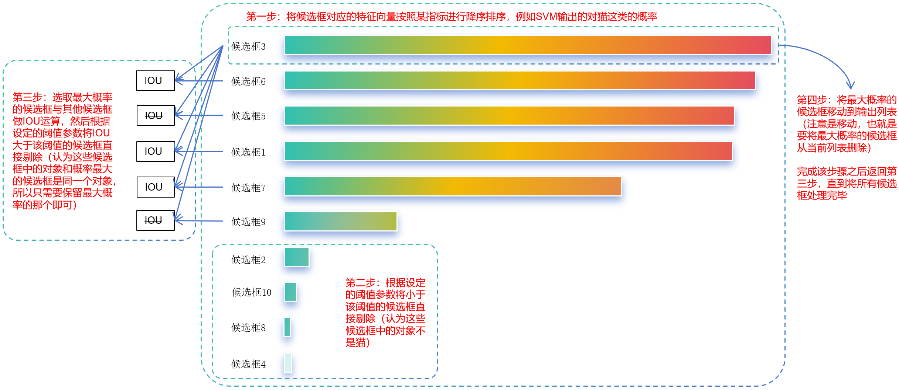

# 目标检测开山之作：深入浅出理解 R-CNN

R-CNN (Regions with CNN features) 是将深度学习应用到目标检测领域的里程碑式算法。虽然它现在看起来比较“笨重”，但它是理解 Fast R-CNN、Faster R-CNN 等现代算法的基石。

R-CNN 的核心思想可以概括为：**把一张图拆成很多小图，分别识别，最后把框修一修。**

其整体工作流程如下图所示：

------

## 1. 第一步：候选区域生成 (Region Proposals)

**—— 大海捞针，不如先圈定范围**

在 R-CNN 之前，传统方法通常使用“滑动窗口”策略，即用不同大小的框在图片上从左到右、从上到下地扫，计算量巨大。

R-CNN 采用了一种更聪明的策略：**Selective Search (选择性搜索)**。

- **原理**：利用图像中的纹理、颜色、光照等信息，通过算法预先把“可能包含物体”的区域框出来。
- **结果**：在一张图片上生成约 **2000 个候选框 (Region Proposals)**。
- **原则**：**宁多勿少**。只要有一点像物体的地方都要框出来，保证不漏检（高召回率）。

------

## 2. 第二步：特征提取 (Feature Extraction)

**—— 给每个框拍张“证件照”**

这一步是将候选框里的图像输入到 CNN (卷积神经网络) 中提取特征。

### 2.1 强制缩放 (Warping)

这里存在一个工程上的难题：

- **输入**：Selective Search 选出的候选框大小各异（有的长条形，有的正方形）。
- **限制**：CNN 模型（论文中使用 AlexNet）的全连接层要求**固定大小的输入**（论文中为 $227 \times 227$）。

**解决方案**：

R-CNN 采取了简单粗暴的 **强制缩放 (Warping)**。无论候选框是扁的还是长的，一律强制拉伸或压缩成 $227 \times 227$ 的像素大小。

> **注意**：这种暴力缩放会导致图像变形（例如人变胖，车变窄），一定程度上会影响特征提取的质量。

### 2.2 特征计算

将缩放后的 2000 张小图分别输入 CNN。最终，CNN 会为每一个候选框输出一个长度为 **4096** 的特征向量。你可以把这个向量理解为这个框的“数字指纹”。

------

## 3. 第三步：类别判断 (SVM Classification)

**—— 是猫还是狗？**

拿到 4096 维的特征向量后，我们需要判断这个框里到底是什么。R-CNN 使用了 **SVM (支持向量机)** 进行分类。

### 3.1 独立的二分类器

假设我们要检测 20 类物体（如猫、狗、车...），我们需要训练 **20 个独立的 SVM 分类器**。

- **工作方式**：

  - “猫分类器”只判断：这是猫，还是不是猫？
  - “狗分类器”只判断：这是狗，还是不是狗？

- **输出**：

  将特征向量输入这 20 个 SVM，会得到 20 个分数（Score）。

  - 注意：因为是互不相关的分类器，这些概率值加起来**不一定等于 1**。

最终，对于一张图片，我们会得到一个 $2000 \times 20$ 的得分矩阵（2000 个框，每个框有 20 个类别的得分）。

------

## 4. 第四步：非极大值抑制 (NMS)

**—— 去除冗余，只留最好的**

Selective Search 生成的框非常多，很多框都是重叠的（例如一个猫头可能有十几个框包围着）。我们需要把重复的框去掉，只保留最好的一个。

这就是 **NMS (Non-Maximum Suppression)** 的作用。

**操作流程**（针对每一类单独进行）：

1. 找到得分最高的框，作为“基准框”。
2. 将其他所有框与这个基准框计算 **IoU (交并比)**。
3. 如果 IoU 大于某个阈值（说明重叠太严重），就认为它们是同一个物体，将得分低的那个框**剔除（抑制）**。
4. 从剩下的框中再选最高分的，重复上述过程。

------

## 5. 第五步：边界框回归 (Bounding Box Regression)

**—— 精修坐标，让框更准**

在原论文中候选框由$$K_x$$、$$K_y$$、$$K_w$$、$$K_h$$4个元素来确定，$$K_x$$、$$K_y$$表示候选框的中心点坐标，$$K_w$$、$$K_h$$分别表示候选框的宽和高。

在Selective Search 中给出的框只是大概位置，可能不够精准（比如框住了人，但切掉了一半手）。我们需要对框进行微调。

- 假设我们有两个框：

  - **红色框 P (Proposal)**：Selective Search 给出的候选框。
  - **绿色框 G (Ground Truth)**：人工标注的完美真值框。

  我们要训练一个模型，输入是 P（以及它对应的图像特征），输出是 G。

  要把 P 变成 G，其实只需要做两个动作：

  1. **平移（Translation）**：把框的中心点挪一挪。
     - $\Delta x$：水平挪一点。
     - $\Delta y$：垂直挪一点。
  2. **缩放（Scale）**：把宽和高拉伸或压缩一下。
     - $S_w$：宽度缩放比例。
     - $S_h$：高度缩放比例。

  **所以，R-CNN 不是直接预测 G 的坐标，而是预测这 4 个“变换量”。**

  ### 5.2 数学推导：R-CNN 是怎么算的？

  这是面试和阅读源码时最容易晕的地方，请仔细看这组公式。

  #### A. 符号定义

  - **候选框 $P$**：$(P_x, P_y, P_w, P_h)$ —— 中心点坐标 $(x, y)$ 和宽高 $(w, h)$。
  - **真值框 $G$**：$(G_x, G_y, G_w, G_h)$。
  - **预测目标**：我们需要学习 4 个变换参数 $t_x, t_y, t_w, t_h$。

  #### B. 平移变换（Translation）

  我们希望预测出的偏移量是**“相对量”**（即相对于框的大小的比例），而不是绝对像素值。为什么要这样？因为大物体和小物体移动 10 个像素的意义是完全不同的。
  $$
  t_x = \frac{G_x - P_x}{P_w}
  $$

  $$
  t_y = \frac{G_y - P_y}{P_h}
  $$

  

  - **解释**：$t_x = 0.5$ 意味着“向右移动半个框宽的距离”。

  #### C. 缩放变换（Scale）

  这是最精妙的一步。我们不对 $w, h$ 直接回归，而是对**对数空间（Log Space）**进行回归。
  $$
  t_w = \log\left(\frac{G_w}{P_w}\right)
  $$

  $$
  t_h = \log\left(\frac{G_h}{P_h}\right)
  $$

  - **为什么要取 Log？**
    - 如果不取 Log，网络可能会预测出负的缩放比例（比如 $-0.5$），导致预测出的宽度变成负数，这在物理上是不可能的。
    - 取 Log 后，预测值 $t$ 可以是正数也可以是负数。还原时使用 $e^t$，**保证了缩放后的宽/高永远是正数**。
    - 例如：$t_w = 0 \implies e^0=1$（大小不变）；$t_w < 0 \implies 0 < e^t < 1$（缩小）；$t_w > 0 \implies e^t > 1$（放大）。

  ### 5.3 网络是如何训练和预测的？

  #### 训练阶段 (Training)

  在 R-CNN 中，边界框回归器是一个**独立的线性回归模型（Ridge Regression）**，不是和 SVM 一起训练的。

  1. **输入**：CNN 提取的特征向量 $\phi(P)$（通常是 Pool5 层特征）。

  2. **目标**：让网络输出的预测值 $d_*(P)$ 尽可能接近真实的变换量 $t_*$。

     - $d_x(P) \approx t_x$
     - $d_y(P) \approx t_y$
     - $d_w(P) \approx t_w$
     - $d_h(P) \approx t_h$

  3. **损失函数**：也就是均方误差（MSE）加上正则化项：
     $$
     Loss = \sum (t_* - w_*^T \phi(P))^2 + \lambda \|w_*\|^2
     $$
     

     *(注：这里只针对那些和 Ground Truth 重叠度 `IoU` > 0.6 的高质量候选框进行训练。离得太远的框根本没法救，训练了反而会干扰模型。)*

  #### 预测/推理阶段 (Inference)

  当网络训练好后，来了一张新图：

  1. CNN 算出特征 $\phi(P)$。

  2. 回归器算出 4 个数值：$d_x, d_y, d_w, d_h$。

  3. **反算（解码）**：根据这 4 个数值，把原来的候选框 $P$ 变成最终预测框 $\hat{G}$：

     - **中心点修正**：

       $$\hat{G}_x = P_w \cdot d_x + P_x$$

       $$\hat{G}_y = P_h \cdot d_y + P_y$$

     - **宽高修正**：

       $$\hat{G}_w = P_w \cdot \exp(d_w)$$

       $$\hat{G}_h = P_h \cdot \exp(d_h)$$

  ### 5.4 总结：为什么这么做？

  R-CNN 中的边界框回归之所以设计成这样，核心是为了解决**“尺度不变性”**的问题。

  - **平移归一化**：除以 $P_w, P_h$，使得模型不用关心物体到底是 100 像素大还是 500 像素大，只关心**相对偏移**。
  - **对数缩放**：使用 $\exp$ 变换，保证了预测出的框永远符合物理规则（长宽为正）。

  这个机制非常经典，后来的 **Fast R-CNN, Faster R-CNN, YOLO, SSD** 几乎全部沿用了这套公式（或其微小的变体）。5

------

## 总结

R-CNN 的流程可以概括为：**Selective Search 提框 -> CNN 提特征 -> SVM 分类 -> NMS 去重 -> 回归器修框**。

它的缺点也非常明显：**慢**。

因为 2000 个候选框都要单独过一遍 CNN，计算量巨大。这也催生了后来的 Fast R-CNN 和 Faster R-CNN，通过“特征共享”来解决速度问题。