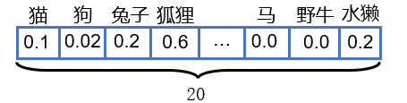

R-CNN的工作流程如下图所示：

## 1.第一步：筛选出检测目标（宁多勿少）

这一步是要传统的selective search算法框选出需要检测的目标，输出“可能包含物体”的候选框约2k个。

## 2.第二步：特征提取

将第一步输出的候选框的图片截取出来后输入到CNN神经网络中，此时存在一个问题，候选框的大小形状不一，而CNN的输入是固定的，论文中使用AlexNet，输入是$$277\times277$$，所以需要调整图片大小。文章中采取的是直接将图片缩放到$$227\times 227$$像素大小的图片中（这会导致图像变形）。

最终CNN会对每个输入输出4096长度的特征向量

## 3.第三步：分类

#### 3.1 SVM分类

 提前训练N个SVM分类器，例如针对猫、狗、兔子等多类物体，在原论文中N=20，即能够识别20类目标对象。

将4096维度的特征向量分别输入到20个SVM中，每个SVM输出一个值，表示特征向量是这类目标对象的概率。例如下图所示的向量

由于是多个分类器输出的概率所以并不一定累加等于1。

所以最终会输出$$2000\times20$$的矩阵。

---

#### 3.2 非极大值抑制

将NMS分别应用到20类别中

## 4.第四步：修正候选框位置（与第三步不分先后）

### 4.1 直观原理：我们需要什么样的“微调”？

在原论文中候选框由$$K_x$$、$$K_y$$、$$K_w$$、$$K_h$$4个元素来确定，$$K_x$$、$$K_y$$表示候选框的中心点坐标，$$K_w$$、$$K_h$$分别表示候选框的宽和高。

假设我们有两个框：

- **红色框 P (Proposal)**：Selective Search 给出的候选框。
- **绿色框 G (Ground Truth)**：人工标注的完美真值框。

我们要训练一个模型，输入是 P（以及它对应的图像特征），输出是 G。

要把 P 变成 G，其实只需要做两个动作：

1. **平移（Translation）**：把框的中心点挪一挪。
   - $\Delta x$：水平挪一点。
   - $\Delta y$：垂直挪一点。
2. **缩放（Scale）**：把宽和高拉伸或压缩一下。
   - $S_w$：宽度缩放比例。
   - $S_h$：高度缩放比例。

**所以，R-CNN 不是直接预测 G 的坐标，而是预测这 4 个“变换量”。**

### 4.2 数学推导：R-CNN 是怎么算的？

这是面试和阅读源码时最容易晕的地方，请仔细看这组公式。

#### A. 符号定义

- **候选框 $P$**：$(P_x, P_y, P_w, P_h)$ —— 中心点坐标 $(x, y)$ 和宽高 $(w, h)$。
- **真值框 $G$**：$(G_x, G_y, G_w, G_h)$。
- **预测目标**：我们需要学习 4 个变换参数 $t_x, t_y, t_w, t_h$。

#### B. 平移变换（Translation）

我们希望预测出的偏移量是**“相对量”**（即相对于框的大小的比例），而不是绝对像素值。为什么要这样？因为大物体和小物体移动 10 个像素的意义是完全不同的。
$$
t_x = \frac{G_x - P_x}{P_w}
$$

$$
t_y = \frac{G_y - P_y}{P_h}
$$

- **解释**：$t_x = 0.5$ 意味着“向右移动半个框宽的距离”。

#### C. 缩放变换（Scale）

这是最精妙的一步。我们不对 $w, h$ 直接回归，而是对**对数空间（Log Space）**进行回归。
$$
t_w = \log\left(\frac{G_w}{P_w}\right)
$$

$$
t_h = \log\left(\frac{G_h}{P_h}\right)
$$

- **为什么要取 Log？**
  - 如果不取 Log，网络可能会预测出负的缩放比例（比如 $-0.5$），导致预测出的宽度变成负数，这在物理上是不可能的。
  - 取 Log 后，预测值 $t$ 可以是正数也可以是负数。还原时使用 $e^t$，**保证了缩放后的宽/高永远是正数**。
  - 例如：$t_w = 0 \implies e^0=1$（大小不变）；$t_w < 0 \implies 0 < e^t < 1$（缩小）；$t_w > 0 \implies e^t > 1$（放大）。

### 4.3 网络是如何训练和预测的？

#### 训练阶段 (Training)

在 R-CNN 中，边界框回归器是一个**独立的线性回归模型（Ridge Regression）**，不是和 SVM 一起训练的。

1. **输入**：CNN 提取的特征向量 $\phi(P)$（通常是 Pool5 层特征）。

2. **目标**：让网络输出的预测值 $d_*(P)$ 尽可能接近真实的变换量 $t_*$。

   - $d_x(P) \approx t_x$
   - $d_y(P) \approx t_y$
   - $d_w(P) \approx t_w$
   - $d_h(P) \approx t_h$

3. **损失函数**：也就是均方误差（MSE）加上正则化项：
   $$
   Loss = \sum (t_* - w_*^T \phi(P))^2 + \lambda \|w_*\|^2
   $$
   

   *(注：这里只针对那些和 Ground Truth 重叠度 `IoU` > 0.6 的高质量候选框进行训练。离得太远的框根本没法救，训练了反而会干扰模型。)*

#### 预测/推理阶段 (Inference)

当网络训练好后，来了一张新图：

1. CNN 算出特征 $\phi(P)$。

2. 回归器算出 4 个数值：$d_x, d_y, d_w, d_h$。

3. **反算（解码）**：根据这 4 个数值，把原来的候选框 $P$ 变成最终预测框 $\hat{G}$：

   - **中心点修正**：

     $$\hat{G}_x = P_w \cdot d_x + P_x$$

     $$\hat{G}_y = P_h \cdot d_y + P_y$$

   - **宽高修正**：

     $$\hat{G}_w = P_w \cdot \exp(d_w)$$

     $$\hat{G}_h = P_h \cdot \exp(d_h)$$

### 4.4 总结：为什么这么做？

R-CNN 中的边界框回归之所以设计成这样，核心是为了解决**“尺度不变性”**的问题。

- **平移归一化**：除以 $P_w, P_h$，使得模型不用关心物体到底是 100 像素大还是 500 像素大，只关心**相对偏移**。
- **对数缩放**：使用 $\exp$ 变换，保证了预测出的框永远符合物理规则（长宽为正）。

这个机制非常经典，后来的 **Fast R-CNN, Faster R-CNN, YOLO, SSD** 几乎全部沿用了这套公式（或其微小的变体）。只要你搞懂了这 4 个公式，所有检测网络的回归层你都能看懂。
