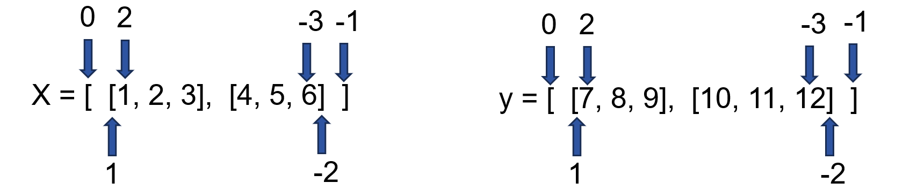

# pytorch中dim属性的用法

## 一、实验代码

```python

import torch

x = torch.tensor([[1, 2, 3],
                  [4, 5, 6]])
y = torch.tensor([[7, 8, 9],
                  [10, 11, 12]])

print(f"torch.sum result when dim=0 :", torch.sum(x, dim=0))
print(f"torch.sum result when dim=1 :", torch.sum(x, dim=1))
print(f"torch.stack result when dim=0 :", torch.stack((x, y), dim=0))
print(f"torch.stack result when dim=1 :", torch.stack((x, y), dim=1))
print(f"torch.stack result when dim=1 :", torch.stack((x, y), dim=2))


```

## 二、运行结果

```html
E:\anaconda\app\envs\pytorch_learn\python.exe F:\myLearnFolder\ML\deep-learning-for-image-processing\pytorch_object_detection\faster_rcnn\my_test.py 
torch.sum result when dim=0 : tensor([5, 7, 9])
torch.sum result when dim=1 : tensor([ 6, 15])
torch.stack result when dim=0 : tensor([[[ 1,  2,  3],
                                         [ 7,  8,  9]],

                                        [[ 4,  5,  6],
                                         [10, 11, 12]]])
torch.stack result when dim=1 : tensor([[[ 1,  2,  3],
                                         [ 7,  8,  9]],

                                        [[ 4,  5,  6],
                                         [10, 11, 12]]])
torch.stack result when dim=1 : tensor([[[ 1,  7],
                                         [ 2,  8],
                                         [ 3,  9]],

                                        [[ 4, 10],
                                         [ 5, 11],
                                         [ 6, 12]]])

```

## 三、结果解析

为了方便讲解，将矩阵写成如下形式，并标记各层级




- 在输入**单个tensor**的这类方法中，torch.sum方法为例，在res = torch.sum(x, dim=0) 中

  - dim=0 表示将“0” 括号这一**层级内**的直接子元素，即[1, 2, 3]和[4, 5, 6]整体看做一个元素进行相加，相加的方式是按列表中的元素相加，得到[[5, 7, 9]]；
  - dim=1表示将“1 ”括号这一**层级内**的直接子元素，即1、 2,、3分别看作一个元素进行相加得到6。同时， “1 ”括号这一层级还有4、5、 6，对其执行相同的操作得到15。合并两个结果得到[[6], [15]]
  - 由于sum是对dim层级内的元素进行相加操作，所以在sum方法中设置dim=2会报错：`IndexError: Dimension out of range (expected to be in range of [-2, 1], but got 2)`

- 在输入**多个tensor**的这类方法中，torch.stack方法为例，在res = torch.stack((x, y), dim=0) 中

  - dim=0 表示将“0” 括号这一**当前层级**，即[[1, 2, 3],[4, 5, 6]]和[[7, 8, 9],[10, 11, 12]]整体看做一个元素拼接起来， 得到[[[1, 2, 3],[4, 5, 6]], [[7, 8, 9],[10, 11, 12]]]
  - dim=1表示将“1”括号这一**当前层级**的列表看作一个整体进行拼接，也就是[1, 2, 3]和[7, 8, 9]拼接得到[[1, 2, 3], [7, 8, 9]]，然后将[4, 5, 6]和[10, 11, 12]拼接起来，直到所有元素都拼接完成。将所有元素放到一个列表中就得到了结果[[[1, 2, 3], [7, 8, 9]], [[4, 5, 6], [10, 11, 12]]]
  - dim=2表示将“2”括号这一**当前层级**的元素看作一个整体进行拼接，也就是1和7拼接得到[1,7]，2和8拼接得到[2,8]，3和9拼接得到[3,9]，将这些结果放入一个列表中得到[[1,7],[2,8],[3,9]]，再将4和10拼接得到[4,10]，以此类推得到 [[ 4, 10], [ 5, 11], [ 6, 12]]，再将这两个结果放到列表中得到结果。

  

> 1、注意两类方法操作时的不同层级
>
> 2、拼接操作需要将得到的结果放到一个列表中，而相加则不需要。列表[...]与列表[...]相加得到还是一个列表[...]，直接输出即可。而拼接则是需要将结果放到列表中[[...],[...],...] , 最内层的元素也是一样。

