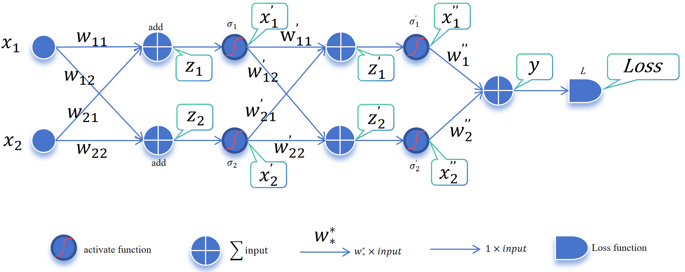
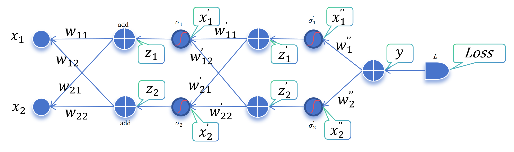

---

title: 反向传播算法原理

date: 2026-02-07 17:43:00 +0800

categories: [Machine Learning, Deep Learning]

tags: [dl, gradient descent, backpropagation, chain rule, theory, notes]

math: true 

img_path: /assets/img/posts/

---

反向传播算法作为深度学习的基石

图中的各个箭头和节点都可以看作是一个计算单元

假设我们需要求解$$\frac{\partial L}{\part w_{11}}$$，根据链式求导法则我们可以得到：
$$
\frac{\partial L}{\part w_{11}} = \frac{\partial L}{\part x_1^{'}}\frac{\part x_1^{'}}{\partial w_{11}}
$$

$$
\frac{\partial L}{\part x_1^{'}} =
\frac{\partial L}{\part y} \frac{\partial y}{\part x_1^{''}} \frac{\partial x_1^{''}}{\part z_1^{'}} \frac{\partial z_1^{'}}{\part x_1^{'}}  
+ 
\frac{\partial L}{\part y} \frac{\partial y}{\part x_2^{''}} \frac{\partial x_2^{''}}{\part z_2^{'}} \frac{\partial z_2^{'}}{\part x_1^{'}}
=w_1^{''}\frac{\partial x_1^{''}}{\part z_1^{'}}w_{11}^{'} + w_2^{''}\frac{\partial x_2^{''}}{\part z_2^{'}}w_{12}^{'}
$$

$$
\frac{\partial x_1^{'}}{\part w_{11}} =
\frac{\partial x_1^{'}}{\part z_1} \frac{\partial z_1}{\part x_1}
=\frac{\partial x_1^{'}}{\part z_1}x_1
$$

> 链式求导法则：①在一条串联了多个计算单元的链路上，各个计算单元的输出对输入做偏导$$\partial_i$$；②然后将各个计算单元的偏导相乘$$z_j = \prod\partial_i$$；③如果有多条串联链路，则将每条串联链路的结果相加$$y = \sum z_j$$
>
> 对于加法运算和恒等单元运算单元求偏导可以数学表示为：$$\frac{\part({a + b})}{\part a}$$ 和 $$\frac{\part(x)}{\part x}$$  其结果都是1，所以可以约掉不写

仔细观察，我们可以知道$$\frac{\partial L}{\part x_1^{'}}$$是由两条线路上的计算单元的偏导相乘再相加得到的，在此基础上，$$\frac{\partial L}{\part x_1^{'}}$$乘以$$\frac{\partial x_1^{'}}{\part z_1}$$，再乘以$$x_1$$就能得到$$\frac{\partial L}{\part w_{11}}$$的结果，整个求解过程就像是从后往前逆箭头方向计算的，所以称之为反向传播。

**正向传播中，各个计算节点都是以$$f(.)$$的形式参与计算的，而反向传播中各个计算节点都是以其偏导数相乘的形式参与计算的。**
